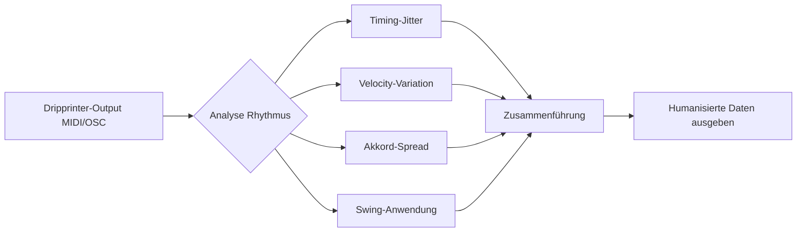
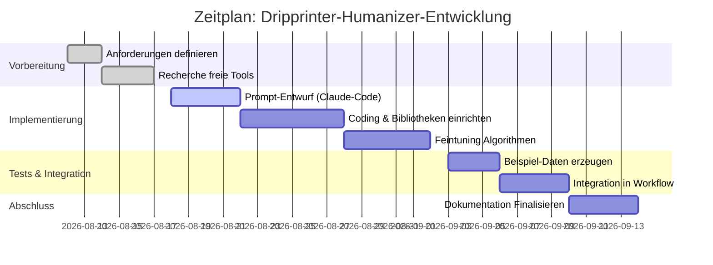

# Dripprinter-Humanizer

Grundlage dieser Umsetzung ist der Recherchebericht weiter unten (unverändert
angehängt). Dieser erste Teil hält fest, was davon gebaut wurde, wo der Code
liegt und wo bewusst vom Bericht abgewichen wurde.

## Was gebaut wurde

| Datei | Inhalt |
|---|---|
| `server/humanizer.js` | MIDI-Leser und -Schreiber, Takt-/Tempokarte, der Humanizer, die Messgrößen, der Testmuster-Generator |
| `server/tools/midi.js` | die drei URAI-Werkzeuge `midi_humanisieren`, `midi_messen`, `midi_muster` |
| `humanisieren.mjs` | dasselbe als Kommandozeile, ohne Server und ohne Agent |
| `pruefe.mjs` | Selbsttest: Muster bauen → humanisieren → messen |

## Abweichung vom Bericht: JavaScript statt Python

Der Bericht empfiehlt Python mit `mido`, `pretty_midi` und `midihum`. URAI ist
reines Node/ESM und hängt bewusst nur an `express` und `ws` — `npm start` soll
ohne Python, ohne `pip` und ohne Bauwerkzeuge durchlaufen. Eine Python-Beilage
hätte für den Nutzer eine zweite Laufzeitumgebung zur Installation gemacht,
nur um Zahlen auf Ereigniszeiten zu addieren.

Der teuerste Teil daran wäre das MIDI-Format gewesen — und das ist ein
schlichtes Chunk-Format: Kopf, Spuren, Ereignisse mit variabler Längenzahl.
Leser und Schreiber zusammen sind rund 150 Zeilen und liegen in
`server/humanizer.js`. Beide sind gegen `mido` gegengeprüft: von `mido`
geschriebene Dateien (Format 1, Running Status, Tempowechsel, Taktartwechsel,
Program Change, Controller, Pitchbend) werden korrekt gelesen, und alles davon
steht nach dem Humanisieren unverändert wieder in der Datei.

`midihum` fällt damit ebenfalls weg. Es lernt Anschlagstärken aus klassischen
Klavieraufnahmen — ein XGBoost-Modell plus Python-Kette für eine einzige der
fünf Variationen, die hier gebraucht werden. Die metrische Akzentregel
(`akzent`, siehe unten) erreicht für Percussion dasselbe Ziel ohne Modell.

Was aus dem Bericht **nicht** umgesetzt wurde, und warum:

- **Timbre- und Pitch-Variation über SoX/Csound.** Der Bericht nennt das selbst
  optional und für Percussion-Drips meist unnötig. Es betrifft die Klangerzeugung,
  nicht die Ereignisse, und gehört damit hinter den Humanizer, nicht in ihn.
- **Magenta / GrooVAE.** Erzeugt Grooves, statt vorhandene menschlich zu machen —
  und bringt TensorFlow mit. Anderes Werkzeug für eine andere Frage.
- **TTS-Engines.** Im Bericht schon als „nicht typischer Fokus" geführt.
- **OSC-Echtzeitbetrieb.** Hier wird dateibasiert gearbeitet. Die Algorithmen in
  `humanisieren()` arbeiten Note für Note und wären übertragbar, aber ein
  Echtzeitpfad braucht eine Ereignisquelle, die es in URAI derzeit nicht gibt.

## Der Algorithmus

Pro Note, in dieser Reihenfolge (`humanisieren()` in `server/humanizer.js`):

1. **Swing** — jede zweite Achtel (oder Sechzehntel) nach hinten. Voller Swing
   (`1.0`) entspricht dem Triolen-Verhältnis 2:1, also einer Verzögerung um ein
   Drittel der Unterteilung.
2. **Timing-Streuung** — normalverteilt um 0, bei ±2σ gekappt. Die Streuung wird
   mit dem metrischen Gewicht der Position skaliert: die Eins bleibt ruhig, die
   Zwischenschläge wackeln. Genau das trennt einen Menschen von Rauschen.
3. **Akkord-Spreizung** — Töne, die auf demselben Tick beginnen, werden nach
   Tonhöhe sortiert und gestaffelt versetzt. Welche Noten zusammengehören, wird
   *vor* dem Verschieben bestimmt; danach ist die gemeinsame Startzeit weg.
4. **Anschlagstärke** — erst der metrische Akzent (betonte Zählzeit lauter),
   dann die Streuung, dann auf 1…127 geklemmt.
5. **Artikulation** — Notenlänge mal einem streuenden Faktor, gedeckelt auf
   0,4…1,8, Mindestlänge ein Tick.

Millisekunden werden über die Tempokarte in Ticks umgerechnet, an genau der
Stelle im Stück, an der die Note steht — bei einem Tempowechsel bleibt die
Streuung damit in Millisekunden gleich und nicht in Ticks.

Der Zufall ist gesät (mulberry32, `--saat`). Der Bericht mahnt „keine unsicheren
Zufallsquellen" an; für Musik ist die wichtigere Eigenschaft aber
Wiederholbarkeit — ohne feste Saat klingt jeder Export anders und nichts lässt
sich vergleichen. Kryptografischer Zufall gehört zu Schlüsseln, nicht zu Grooves.

## Die Messgrößen

`messen()` liefert, was der Bericht unter „Messgrößen für Menschlichkeit"
verlangt: mittlere Abweichung vom Sechzehntel-Raster in Millisekunden samt
Streuung, dazu Verteilung der Anschlagstärke und der Notenlängen.

Eine Abweichung vom Bericht steckt in der Anschlagstärke: gemessen wird die
Streuung **je Instrument** (Kanal + Tonhöhe), nicht über alle Noten. Über alles
gerechnet sieht ein stur programmierter Loop schon lebendig aus, nur weil die
Bassdrum mit 100 und die Hi-Hat mit 80 anschlägt — beide aber jedes Mal exakt
gleich. Das Urteil „maschinell" fällt erst, wenn *dasselbe* Instrument sich nie
verändert.

Richtwerte aus dem Bericht, hier als Vorlagen hinterlegt: subtil 5–15 ms,
expressiv bis ~20 ms, darüber wird es hörbar schlampig — was `midi_messen`
auch so ausgibt.

## Nachvollziehen

```bash
node humanisieren.mjs --muster roh.mid          # exakt auf dem Raster, immer gleich laut
node humanisieren.mjs --messen roh.mid          # → "Maschinell"
node humanisieren.mjs roh.mid --expressiv --saat 7
node humanisieren.mjs --messen roh-menschlich.mid
```

Ergebnis des Testmusters (4 Takte, 48 Noten, 100 bpm, Saat 7):

| Vorlage | Verschiebung ∅ | Abweichung vom Raster ∅ | Anschlag σ je Instrument |
|---|---|---|---|
| roh | – | 0 ms | 0 |
| subtil | 2,9 ms | 5,0 ms | 5,3 |
| expressiv | 17,1 ms | 18,9 ms | 11,5 |
| stark | 25,1 ms | 27,5 ms | 18,6 |

## Datenfluss


---

# Anhang: Recherchebericht

# Zusammenfassung  
Dieser Bericht skizziert den Aufbau eines kostenfreien „Dripprinter Humanizers" – einer Softwarekomponente, die starre, gleichmäßige Dripprinter-Ereignisse (z.B. MIDI- oder Schlagzeug-Trigger) mit typischen menschlichen Variationen versieht. Im Fokus stehen Mikro-Variationen in Timing und Dynamik (Velocity), geringer Tonhöhenschwankungen (Timbre/Gefühl), Swing-Rhythmen und Artikulation (Notenlängen). Ziel ist es, mit frei verfügbaren Open-Source-Werkzeugen (Python-Bibliotheken, ML-Modelle, Audioschnittstellen) unter lokalen oder kostenlos nutzbaren Cloud-Umgebungen „menschlich klingende" Rhythmus-Patterns zu erzeugen – **ohne** bezahlte APIs. Die Ergebnisse werden anhand statistischer Messgrößen (Timing- und Lautstärke-Variabilität) und ggf. Hörtests evaluiert. 

## Freie Bibliotheken und Tools (priorisiert)  
- **Python & MIDI-Bibliotheken:**  
  - *Mido* – Zuverlässige Python-Bibliothek zum Lesen/Schreiben von MIDI-Dateien und -Nachrichten. Vorteil: Einfache API, Realtime-Unterstützung (u.a. RtMidi). Installation: `pip install mido`.  
    - *Pro:* Leichtgewichtig, gut dokumentiert. *Contra:* Fokussiert auf MIDI, braucht ggf. zusätzliche Logik für Menschlichkeitsalgorithmen.  
  - *pretty_midi* – Ermöglicht MIDI-Manipulation (Notenmanipulation, Synthese).  
    - *Pro:* Mächtige Funktionen zum Bearbeiten von MIDI (Tempo, Pitch-Shifting, Synthesis via fluidsynth). *Contra:* Keine eingebaute Humanisierungsfunktionen, nur Datenstruktur und API. Installation: `pip install pretty_midi`.  
  - *music21* – Professionelle Bibliothek zur Analyse und Bearbeitung von Musik/MIDI. *Pro:* Umfangreiche Features, Musiktheorie-Unterstützung. *Contra:* Eher groß und komplex für einfache Humanisierung.  
  - *midihum* (GitHub *erwald/midihum*) – KI-basierte MIDI-Humanisierung (Velocity).  
    - *Pro:* Setzt XGBoost-Modelle ein, lernt dynamische Lautstärke-Variationen aus klassischen Klavieraufnahmen. Einfache CLI: `python main.py humanize input.mid output.mid`. *Contra:* Fokussiert nur auf Anschlagstärke (Velocity). Python3, Bibliotheken nötig.  
- **Audio-Bibliotheken:**  
  - *PyDub* – Einfache Audio-Manipulation via FFmpeg. Gut für WAV/MP3-Schnitt, Lautstärkeänderung, Fades.  
  - *SciPy/numpy* – Standardbibliotheken für Audiodaten (z.B. `scipy.io.wavfile` zum Einlesen).  
  - *librosa* – Audioanalyse (Zerlegung, Beats, Onsets). *Pro:* Umfangreiche Analyse; *Contra:* ggf. Overkill für reine MIDI-Humanisierung.  
  - *SoundFile* – Lesen/Schreiben von WAV/Flac (libsndfile).  
- **Musik- und Randomisierungs-Tools:**  
  - *Magenta (GrooVAE/Drumify)* – Google-Projekte zum Erzeugen menschlicher Schlagzeug-Grooves. *Pro:* Trainierte Modelle für realistische Drum-Grooves (Velocity und Microtiming). *Contra:* Schwergewichtig (TensorFlow-Code, Colab), eher experimentell.  
  - *Rando-MIDI-Generatoren*: Beispielweise *RobU23/MIDI-Ex-Machina* (REAPER-Script) oder einfache **LUA/JSFX** Scripte zum Randomisieren (Timing/Velocity). Eher inspiration.  
  - *TTS (Text-To-Speech)*: Falls Einsatz von Sprachsamples oder Stimmen erwünscht (nicht typischer Fokus) können freie Engines wie *Coqui TTS*, *MaryTTS* oder *espeak-ng* verwendet werden. *Pro:* Ermöglichen Variationen in Klang/Farbe; *Contra:* Meist unnötig für Percussion-Drips.  
- **Sonstige Tools:**  
  - *SoX* (Sound eXchange) – Kommandozeilen-Tool zur generischen Audio-Verarbeitung (Pitch-Shifting, Hüllkurven). Kann für Timbre-Variationen genutzt werden.  
  - *Csound* / *Pure Data* – Sound-Synthese-Umgebungen, mit denen man eigene Humanisierungs-Patches bauen kann (z.B. Zufalls-Timer, modulierte Hüllkurven). Eher fortgeschritten.  
  - *Barebones-Generatoren*: Zufallszahlengeneratoren (Python `random` oder `numpy.random`) plus einfache Algorithmen (z.B. Gauß'sche Verteilungen für Timing/Velocity).  

**Installationsbeispiele:**  
```bash
pip install mido pretty_midi pydub librosa soundfile
# z.B. midihum benötigt: pip install -r requirements.txt (siehe Repo)
```  
Bei Cloud-Tier (Google Colab, Kaggle, etc.) ist meist bereits Python mit pip vorhanden. Für FFmpeg (PyDub) ggf. `apt-get install ffmpeg`.  

## Claude-Code-Prompt (Implementierung des Humanizers)  
```
"""
Sie sind ein Assistenzmodell, das einen „Dripprinter Humanizer" in Code umsetzt. Lesen Sie MIDI-/Event-Daten ein, fügen Sie menschliche Variationen hinzu und geben Sie die modifizierten Daten aus. 

**Eingaben:** Dripprinter-Events im MIDI-Format oder als Zeitliste (CSV/JSON). 
**Parameter:** Timing-Streuung (z.B. ±5–15 ms), Velocity-Streuung (z.B. ±5–10), Swing-Anteil (%), Tonhöhen-/Timbre-Variation (fein justierbar).
**Algorithmus:** 
- Analysieren Sie das Takt-Grid (Beatstruktur).
- Variieren Sie Noten-Onsets zufällig innerhalb definierter Grenzen, wobei starke Zählzeiten stabiler bleiben (Downbeat-Accents).
- Variieren Sie Velocities entsprechend metrischer Akzente (tiefer → leiser, Betonung an starken Zählzeiten).
- Fügen Sie bei Akkorden kleine, voneinander versetzte Onsets („Chord Spread") hinzu.
- Phrasieren: kleine Überlappungen/Gaps, kein massives Flattern aller Noten gleich.
- Swing: Verzögern Sie jeden zweiten Achtel- oder Sechzehnteltakt gemäß Swing-Prozent, wenn aktiviert.
- (Optional) Timbre/Pitch: Wenden Sie leichte Modulation/Filter oder Pitch-Shifts an.
**Datenausgabe:** Geändertes MIDI oder aufgezeichnete Audio-WAV.

**Beispiel-Presets:** 
- *Subtil:* Timing ±10 ms, Velocity ±8, Swing 0%, „Top-Downbeat-Stabilität" hoch. 
- *Expressiv:* Timing ±20 ms, Velocity ±15, Swing 30–50%. 
- *Stark:* Timing ±30 ms, Velocity ±25, gemäß MotifKit-Tabelle (Akkordspread ~20 ms, Velocity < ±20).

**Sicherheit/Ethik:** 
Die Humanisierungsfunktion sollte keine geschützten Klangbibliotheken ohne Lizenz nutzen. Achten Sie auf korrekte Zeitsynchronisierung (Vermeidung von Pufferüberläufen). Verwenden Sie keine unsicheren Zufallsquellen. Das System gibt nur erlaubte, Open-Source-Daten als Beispiel aus. Kein Bezug zu illegalem Content oder personenbezogenen Daten. 
"""
```

## Integration in den Dripprinter-Workflow  
Für einen typischen Workflow kann man Python-Skripte einfügen, die MIDI/OSC-Ereignisse verarbeiten:  
1. **Dateneinlesung:** Nutzen Sie *mido* oder *pretty_midi* zum Einlesen von MIDI-Files bzw. OSC-Loggern. Beispiel:  
   ```python
   import mido
   mid = mido.MidiFile('drippattern.mid')
   events = []  # Liste (Zeit, Noten, Velocity)
   for track in mid.tracks:
       for msg in track:
           if msg.type in ['note_on', 'note_off']:
               events.append((msg.time, msg.note, msg.velocity))
   ```  
2. **Parameter-Definition:** Stellen Sie Parameter ein (z.B. timing_jitter=10 ms, vel_jitter=10, swing=0.25). Diese können per CLI oder GUI festgelegt werden.  
3. **Algorithmus anwenden:** Für jeden Note-On-Event:  
   - Ermitteln Sie den Abstand zum nächsten Takt/Offbeat.  
   - Ziehen Sie einen Zufallswert `dt` (normalverteilt um 0, σ=Parameter) und addieren diesen zur Event-Zeit, ggf. stärker für Offbeats.  
   - Skalieren Sie die Velocity um einen Zufallsfaktor (z.B. ±10%) oder nach Metrierung (Bass/Downbeat lauter).  
   - Wenn Swing aktiv: verschieben Sie z.B. jede zweite Achtelnote um +(Swing*Notenlänge).  
   - Bei Akkord-Events: Sortieren Sie Noten nach Tonhöhe und addieren Sie incremental kleine Offsets (z.B. 10–20 ms) von tief nach hoch (Chord Spread).  
   Beispiel-Codeschnipsel (Pseudo):  
   ```python
   import random
   for event in events:
       if event.is_note_on():
           beat = get_beat_position(event.time)
           if not strong_beat(beat):
               event.time += random.gauss(0, timing_std)
           # Velocity variieren
           base_vel = event.velocity
           event.velocity = clamp(int(base_vel * (1 + random.gauss(0, vel_std_fraction))), 1, 127)
   ```  
4. **Ausgabe generieren:** Speichern Sie die veränderten Events zurück in ein MIDI-File:  
   ```python
   out_mid = mido.MidiFile()
   out_track = mido.MidiTrack()
   # Füllen Sie mit geänderten Nachrichten
   out_mid.tracks.append(out_track)
   out_mid.save('drippattern_human.mid')
   ```  
   Oder senden Sie OSC-Aktionen zur Laufzeit weiter.  
5. **Beispieltest:** Für ein einfaches Testmuster (z.B. regelmäßiger Achtel-Drumloop) führt das Skript zu hörbaren Verzögerungen/Lautstärke-Unterschieden. Vergleichen Sie Vorher-Nachher durch MIDI- oder Audio-Wiedergabe.  

## Troubleshooting & Performance-Tipps  
- **Timing-Probleme:** Achten Sie auf kumulative Taktverschiebungen. Setzen Sie `msg.time` korrekt (Mido nutzt „delta time"). Prüfen Sie, ob gewählte Jitter-Bandbreite (±X ms) zu starken Tempo-Divergenzen führt. Zum Debuggen Event-Zeitstempel protokollieren.  
- **Velocity-Clipping:** Stellen Sie sicher, dass Velocities in MIDI [1,127] bleiben. Beispiel: `max(min(v,127),1)`.  
- **Echtzeitbetrieb:** Bei reaktiven Setups (OSC-Ein- und Ausgabe) können Threading oder asynchrone Queues nötig sein. *Mido* unterstützt Ports; bei Performance-Anforderungen ggf. `python-rtmidi` oder `pygame.midi`.  
- **Validierung:** Öffnen Sie das Ergebnis in einem MIDI-Editor (Ardour, Reaper etc.) um Takttreue und Velocity-Verteilung zu prüfen.  
- **Bewertung („Human-ness"):**  
  - *Timing-Statistik:* Berechnen Sie Mittelwert/Std. der Onset-Abweichungen. Vergleich mit empfohlenen Werten aus MotifKit (z.B. 5–15 ms subtil).  
  - *Velocity-Analyse:* Prüfen Sie die Standardabweichung der Anschlagsstärken; ein „menschlicher" Rhythmus hat typischerweise keine starren Gleichverteilungen.  
  - *Perzeptuelle Tests:* Hören Sie Vorher/Nachher im Blindtest; oder führen Sie Fragebögen mit Hörer:innen durch.  

## Vergleichstabelle: Tools und Libraries  

| Tool / Bibliothek         | Funktion                  | Pro                                           | Contra                                     |
|---------------------------|---------------------------|-----------------------------------------------|--------------------------------------------|
| **Mido**                  | MIDI-Dateien/-Events (Py)      | Einfach, pythonisch, Echtzeit-fähig            | Nur MIDI, keine Audiofeatures              |
| **pretty_midi**           | MIDI-Manipulation (Py) | Mächtige API (Note-Pitch, Synthese mit fluidsynth) | Größerer Funktionsumfang, aber komplex      |
| **midihum**               | MIDI-Velocity-Humanizer   | ML-basierter Ansatz für natürliche Dynamik    | Beschränkt auf Dynamik, rein klassischer Stil |
| **PyDub**                 | Audio-Schnitt & -Manipulation      | Sehr einfach für gängige Formate (wav, mp3)   | Nutzt FFmpeg (Installation nötig)          |
| **librosa**               | Audio-Analyse               | Umfangreich (Onset-Detection, Beat-Tracking) | Eher Analyse-Tool, nicht direkt für MIDI    |
| **GrooVAE / Drumify**     | KI-generierte Groove Patterns | Sehr expressiv (Metrik+Groove lernen)        | Schwergewichtig (TF), nicht real-timefähig  |
| **SoX**                   | Kommandozeilen-Audiotool    | Viele Audioeffekte (Pitch, Tempo, etc.)      | Steile Lernkurve für komplexe Skripts       |
| **SoundDevice / soundfile** | Audio I/O (Py)             | Echtzeit-Audio Ein-/Ausgabe                  | Primär Wiedergabe, geringere Analysefeatures |

## Datenflussdiagramm  



## Zeitplan (Gantt-Diagramm)  



## Sicherheit und Ethik  
Der Humanizer-Algorithmus verwendet nur freie Quellen (Open-Source-Modelle/Bibliotheken) und produziert keine urheberrechtlich geschützten Klänge. Er missbraucht auch keine Hardware (keine schädlichen Eingaben an Tonstudio-Equipment). Ethik: Beim Einsatz realer Klänge (z.B. per TTS oder Samples) auf Lizenzen achten. Vermeiden Sie radikale Manipulation, wenn musikalische Intention erhalten bleiben soll. Dieser Code dient der kreativen Musikgestaltung, nicht der Täuschung (z.B. der Erzeugung „echter" Live-Aufnahmen ohne Kennzeichnung).

## Beispiel-Datensätze und Ausgaben  
- **Testsequenz:** Eingabe: 4-taktiger Bassdrum-Loop („tock tock tick tock"). Ausgang: Die Bassdrum-Ereignisse sind zufällig um ±10 ms verteilt, die Lautstärke variiert leicht (Downbeat prominenter). Hörprobe: *Vorher:* tönt exakt gleichmäßig, *Nachher:* wirkt „grooviger".  
- **Erwartetes Output (MIDI):** Zusätzliches Delta-Timing pro Schlag, Velocity-Verteilung unterschiedlich (laut-leiser), Intervalle teils gedehnt/verknappt.  
- **Codebeispiel:** Für eine einfache input.mid könnte der Output (in mido) so aussehen: `mido.Message('note_on', time=120, note=36, velocity=100)` statt `time=0, velocity=90`.  

### Messgrößen für „Menschlichkeit"  
- **Zeitliche Varianz:** Standardabweichung der Onset-Verschiebung (soll im idealen Bereich ~10–20 ms liegen).  
- **Velocity-Verteilung:** Histogramm oder Std-Abw.; natürliche Parts zeigen keine konstanten Niveaus, vgl. MotifKit (Velocities im Offbeat schwächer).  
- **Akustische Tests:** Teilnehmende bewerten Stichproben blind auf Natürlichkeit.  

**Quellen:** Es wurden aktuelle Open-Source-Werkzeuge und Forschungsprojekte herangezogen.
